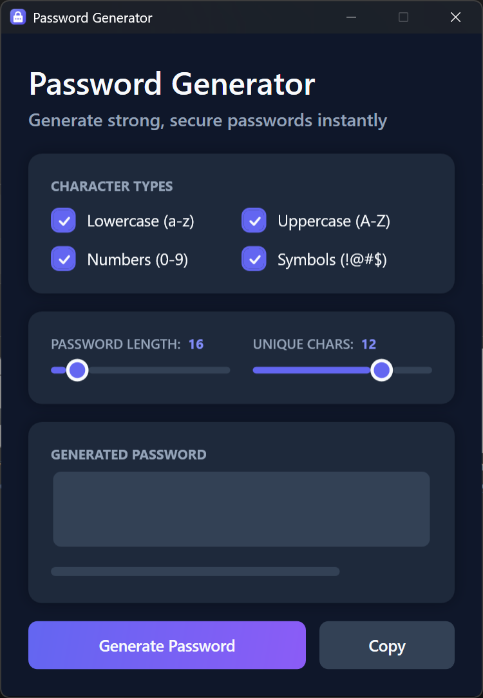
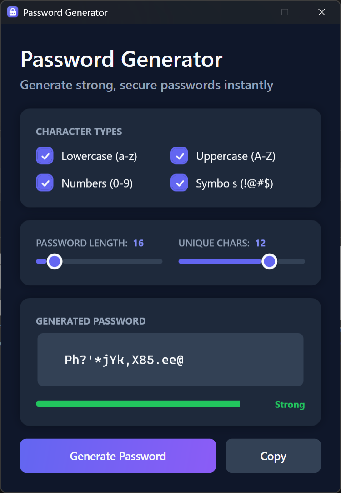

# Password Generator

[](https://github.com/haseebn19/passgen/actions/workflows/ci.yml)


A modern WPF password generator with real-time strength evaluation.

## Screenshots





## Features

- **Character Options**: Lowercase, uppercase, numbers, and symbols
- **Password Length**: Configurable from 4 to 128 characters
- **Unique Characters**: Guarantee a minimum number of unique characters
- **Strength Indicator**: Real-time evaluation using Zxcvbn
- **System Theme**: Follows Windows dark/light mode
- **Clipboard Support**: One-click copy to clipboard

## Prerequisites

- Windows 10/11
- [.NET 8.0 Desktop Runtime](https://dotnet.microsoft.com/download/dotnet/8.0/runtime)

## Installation

```powershell
git clone https://github.com/haseebn19/passgen.git
cd passgen
dotnet restore
```

## Usage

```powershell
cd PassgenWPF
dotnet run
```

1. Select character types to include
2. Adjust password length and unique character count
3. Click **Generate Password**
4. Copy to clipboard with one click

## Development

### Setup

```powershell
git clone https://github.com/haseebn19/passgen.git
cd passgen
dotnet restore
```

### Testing

```powershell
dotnet test
```

With coverage:

```powershell
dotnet test --collect:"XPlat Code Coverage"
```

### Linting

```powershell
dotnet build
```

Linting is enforced via `.editorconfig` and .NET analyzers during build.

## Building

```powershell
dotnet publish -c Release
```

Output: `PassgenWPF/bin/Release/net8.0-windows/win-x64/publish/Passgen.exe`

## Project Structure

```
passgen/
├── PassgenWPF/              # Main application
│   ├── Converters/          # XAML value converters
│   ├── Helpers/             # Window and theme utilities
│   ├── Services/            # Password generation logic
│   ├── Themes/              # Dark and light color schemes
│   ├── ViewModels/          # MVVM view models
│   └── Views/               # XAML windows
├── PassgenWPF.Tests/        # Unit tests
└── docs/                    # Screenshots
```

## Contributing

1. Fork the repository
2. Create a feature branch (`git checkout -b feature/amazing-feature`)
3. Commit your changes (`git commit -m 'Add amazing feature'`)
4. Push to the branch (`git push origin feature/amazing-feature`)
5. Open a Pull Request

## Credits

- [CommunityToolkit.Mvvm](https://github.com/CommunityToolkit/dotnet) - MVVM infrastructure
- [zxcvbn-core](https://github.com/trichards57/zxcvbn-cs) - Password strength estimation

## License

This project is licensed under the [MIT License](https://opensource.org/licenses/MIT).
