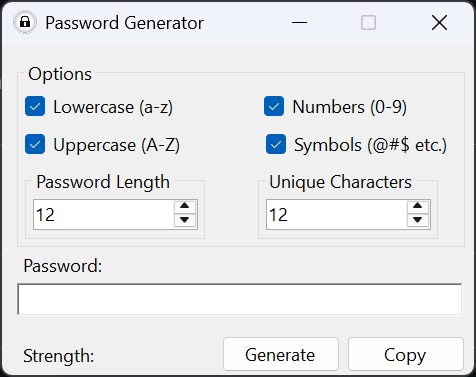
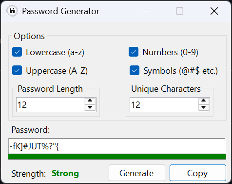

# Password Generator


Password Generator is a Windows Forms application designed to generate strong and customizable passwords. Built with C# and .NET 6.0, this application provides a user-friendly interface for generating passwords with different character sets and lengths. It also evaluates the strength of the generated passwords in real-time using the Zxcvbn library.

## Screenshots

**Main Window**



**After Generating a Password**



## Features

- **Character Set Selection**: Choose from lowercase, uppercase, numbers, and symbols for password generation.
  
- **Password Length**: Customize the length of the generated password.
  
- **Unique Characters**: Specify the number of unique characters in the password.
  
- **Strength Indicator**: Real-time password strength evaluation based on the Zxcvbn library.
  
- **Clipboard Support**: Easily copy the generated password to the clipboard.

## Prerequisites

- .NET 6.0
- Windows OS

## Installation

1. Clone the repository:
   ```powershell
   git clone https://github.com/haseebn19/passgen.git
   ```
   
2. Open the solution file in Visual Studio.

3. Publish the project.

4. Run the application.

## Usage

1. Select the desired character sets and password length.
  
2. Optionally, specify the number of unique characters.
  
3. Click the "Generate" button to generate the password.
  
4. View the password strength and copy the password if needed.

## Contributing

If you'd like to contribute to the development of my password generator or have suggestions for improvements, please fork the repository and submit a pull request.

## License

This project is licensed under the [MIT License](https://opensource.org/licenses/MIT).
